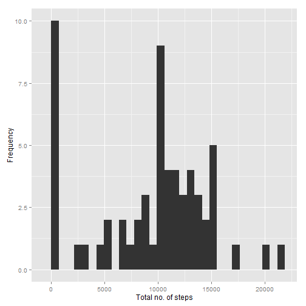
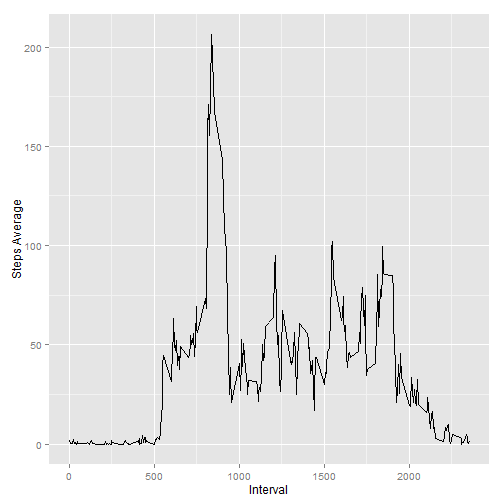
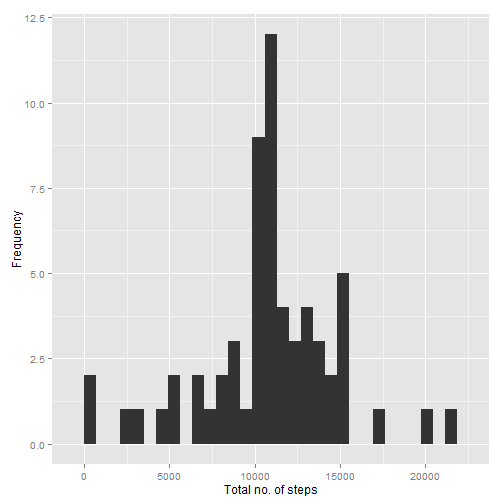

# Reproducible Research: Peer Assessment 1

## Loading and preprocessing the data


```r
library(ggplot2)
CSV_FILE <- "activity.csv"
ZIP_FILE <- "activity.zip"

if(!file.exists(CSV_FILE)) {
  unzip(ZIP_FILE)
}

# Helper function to aggregate data using sum()
act_agg <- function(act_data) {
  agg_data <- aggregate(x = act_data$steps, by = list(date = act_data$date), FUN = "sum", na.rm=TRUE)
  colnames(agg_data) <- c("date", "steps")
  return(agg_data)
}

# Helper function to calculate the mean
act_mean <- function(act_data) {
  agg_data <- act_agg(act_data)
  act_mean <- mean(x=agg_data$steps, na.rm=TRUE)
  return(act_mean)
}

# Helper function to calculate the median
act_median <- function(act_data) {
  agg_data <- act_agg(act_data)
  median(x=agg_data$steps, na.rm=TRUE)
}

# Helper function to display a histogram
act_hist <- function(act_data) {
  agg_data <- act_agg(act_data)
  print(qplot(x=agg_data$steps, geom = "histogram", xlab="Total no. of steps", ylab="Frequency"))
}
```


```r
act_data <- read.csv(CSV_FILE)
# Convert date column to R format
act_data$date <- as.Date(act_data$date, "%Y-%m-%d")
```

## What is mean total number of steps taken per day?

Histogram showing the total number of steps during the day:


```r
act_hist(act_data)
```

```
## stat_bin: binwidth defaulted to range/30. Use 'binwidth = x' to adjust this.
```

 

The average number of steps taken each day: 9354.2295

The median total number of steps taken each day: 10395

## What is the average daily activity pattern?


```r
# Remove the "date" column, since it is not needed
act_pattern <- act_data[,c(1,3)]
act_pattern <- aggregate(x = act_data$steps, by = list(interval = act_data$interval), FUN = "mean", na.rm=TRUE)
```

Time series plot displaying the average number of steps per interval:


```r
print(qplot(x=act_pattern$interval, y=act_pattern$x, data=act_pattern, geom="line",
            ylab="Steps Average", xlab="Interval"))
```

 

The 5-min interval containing the maximum number of steps: 835 (206.1698 steps).

## Imputing missing values

Total number of rows with NA values: 2304.

Replace all missing values in the dataset (NA's) with the average number of steps taken that specific interval over all days in the dataset. I.e. let's say for a row belonging to interval 15, the recorded number of steps is {NA, 5, 10}, the NA value will be replaced by 7.5 (the mean of {5,10}).


```r
# iterate over all rows with missing values
act_data_modif <- act_data
for(row in which(is.na(act_data_modif$steps))){
  # get average for interval, round it and add 1 to make sure it's > 0 (probability of zero is bad!)
  gen_value <- 
    ceiling(
      mean(
        act_data[which(act_data$interval == act_data_modif[row,]$interval),]$steps, na.rm=TRUE)) + 1
  #text <- c("inputing", gen_value)
  #print(text)
  act_data_modif[row,]$steps <- gen_value 
}
```

Histogram showing the total number of steps during the day:


```r
act_hist(act_data_modif)
```

```
## stat_bin: binwidth defaulted to range/30. Use 'binwidth = x' to adjust this.
```

 

The average number of steps taken each day: 1.0823 &times; 10<sup>4</sup>

The median total number of steps taken each day: 1.1197 &times; 10<sup>4</sup>

## Are there differences in activity patterns between weekdays and weekends?


```r
# Add weekday to data set
SATURDAY <- 6
SUNDAY <- 0
act_data_week <- aggregate(x = act_data$steps, by = list(date = act_data$date), FUN = "sum", na.rm=TRUE)
colnames(act_data_week) <- c("date", "steps")
weekends <- which(as.POSIXlt(act_data_week$date)$wday %in% c(SATURDAY,SUNDAY))
act_data_week["type_of_day"] <- "weekday"
act_data_week[weekends,]$type_of_day <- "weekend"
act_data_week$type_of_day <- factor(act_data_week$type_of_day)
```


```r
p <- ggplot(data=act_data_week, aes(x=date, y=steps)) + geom_line(shape=1)
p <- p + facet_grid(type_of_day ~ .)
print(p)
```

 
