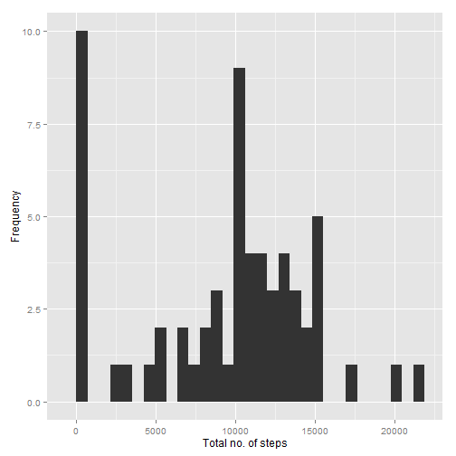
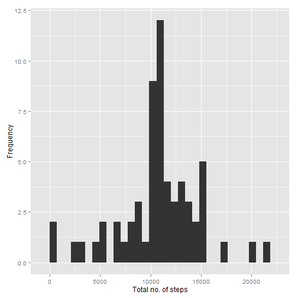
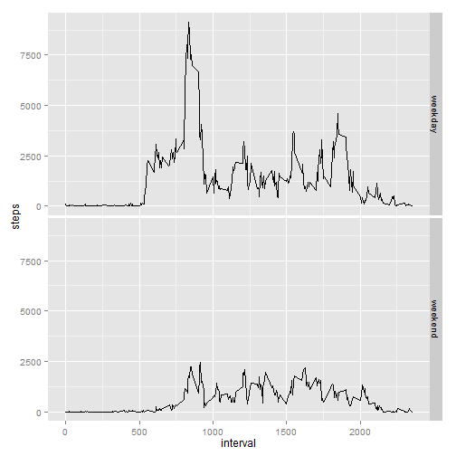

# Reproducible Research: Peer Assessment 1

## Loading and preprocessing the data


```r
library(ggplot2)
CSV_FILE <- "activity.csv"
ZIP_FILE <- "activity.zip"

if(!file.exists(CSV_FILE)) {
  unzip(ZIP_FILE)
}

act_data <- read.csv(CSV_FILE)
act_data$date <- as.Date(act_data$date, "%Y-%m-%d")
act_data_orig <- act_data
SATURDAY <- 6
SUNDAY <- 0
options(scipen = 1, digits = 2)
```

## What is mean total number of steps taken per day?

Histogram showing the total number of steps during the day:


```r
agg_data_sum_day <- aggregate(x = act_data$steps, by = list(date = act_data$date), FUN = "sum", na.rm=TRUE)
colnames(agg_data_sum_day) <- c("date", "steps")
suppressMessages(print(qplot(x=agg_data_sum_day$steps, geom = "histogram", xlab="Total no. of steps", ylab="Frequency")))
```

 

The average number of steps taken each day: 9354.23

The median total number of steps taken each day: 10395

## What is the average daily activity pattern?


```r
act_pattern <- act_data[,c(1,3)] # Remove 'date' column
act_pattern <- aggregate(x = act_data$steps, by = list(interval = act_data$interval), FUN = "mean", na.rm=TRUE)
```

Time series plot displaying the average number of steps per interval:


```r
print(qplot(x=act_pattern$interval, y=act_pattern$x, data=act_pattern, geom="line",
            ylab="Steps Average", xlab="Interval"))
```

 

The 5-min interval containing the maximum number of steps: 835 (average steps 206.17).

## Imputing missing values

Total number of rows with NA values: 2304.

Replace all missing values in the dataset with the average number of steps taken that interval. I.e. let's say for a row belonging to interval 15, the recorded number of steps is {NA, 5, 10}, the NA value will be replaced by 7.5 (mean of {5,10}). The average steps for a day will be modified to always be larger than 0.


```r
act_data_modif <- act_data
for(row in which(is.na(act_data_modif$steps))){
  gen_value <- 
    ceiling(
      mean(
        act_data[which(act_data$interval == act_data_modif[row,]$interval),]$steps, na.rm=TRUE)) + 1
  act_data_modif[row,]$steps <- gen_value 
}
act_data <- act_data_modif # replace original data, so chunk 'histogram_total_steps' can be re-used below
```

Histogram showing the total number of steps during the day:


```r
agg_data_sum_day <- aggregate(x = act_data$steps, by = list(date = act_data$date), FUN = "sum", na.rm=TRUE)
colnames(agg_data_sum_day) <- c("date", "steps")
suppressMessages(print(qplot(x=agg_data_sum_day$steps, geom = "histogram", xlab="Total no. of steps", ylab="Frequency")))
```

 

The average number of steps taken each day: 10822.69

The median total number of steps taken each day: 11197

## Are there differences in activity patterns between weekdays and weekends?


```r
act_data_week <- act_data_orig # get non-imputed data
weekends <- which(as.POSIXlt(act_data_week$date)$wday %in% c(SATURDAY,SUNDAY))
act_data_week["type_of_day"] <- "weekday"
act_data_week[weekends,]$type_of_day <- "weekend"
act_data_week$type_of_day <- factor(act_data_week$type_of_day)
act_data_week <- aggregate(x = act_data_week$steps,
                           by = list(interval = act_data_week$interval, 
                                     type_of_day = act_data_week$type_of_day),
                           FUN = "sum", na.rm=TRUE)
colnames(act_data_week) <- c("interval", "type_of_day", "steps")
```


```r
p <- ggplot(data=act_data_week, aes(x=interval, y=steps)) + geom_line(shape=1)
p <- p + facet_grid(type_of_day ~ .)
print(p)
```

 
